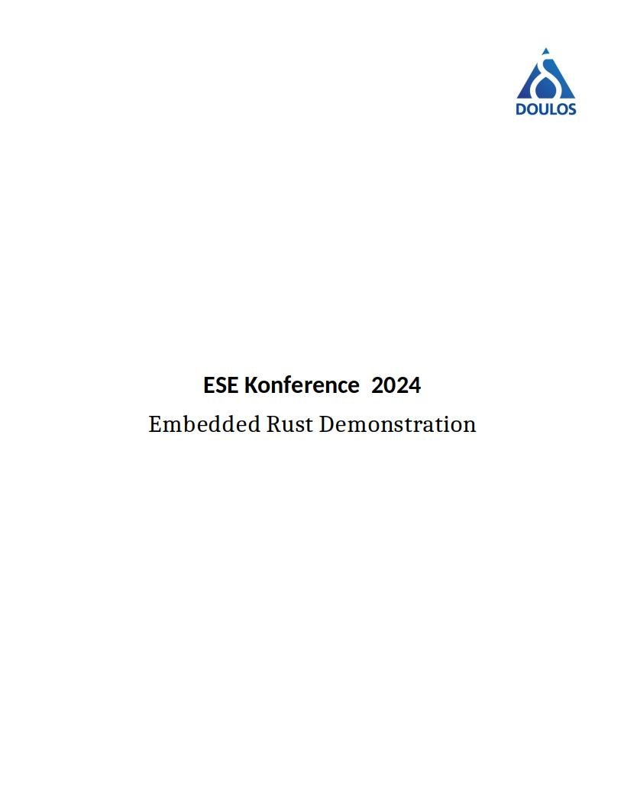

<div style="page-break-after: always; break-after: page;"></div>


<div style="page-break-after: always; break-after: page;"></div>

# Bare-metal Rust Development Demo

[TOC]


## Part 1: Setting up an embedded Rust development environment


### Aims

We are going to go through the steps required to have a working Rust development environment on a Linux machine.

### Background

Installing rust is a relatively painless effort however, numerous utilities can also be added to your setup in order to facilitate your Rust development task. In this hands-on demonstration, we will install and try some of these handy utilities.


### Actions

#### Basic installation

- Open a Linux terminal and type the command:
`curl --proto '=https' --tlsv1.2 -sSf https://sh.rustup.rs | sh`

- During the installation choose option (1) proceed with installation (defaults)

*Note:* Remember to follow the instructions post installation and source the "$HOME/.cargo/env"

For instructions about installing Rust on a different Operating System, please refer to the instructions found inside the following web-page:

https://www.rust-lang.org/learn/get-started


#### Additional components

- Download and install the VSCode IDE from the following the instructions found on the follwing page:

https://code.visualstudio.com/docs/setup/linux

- Type the command:

`rustup component add rust-src`

This is a local copy of the source code of the Rust standard library. This can be used by VSCode to provide auto-completion features.


#### Checking the Rust's toolchain installation

To check what is currently installed, type the command:

`rustup show`


#### Installing binary utilities

Next we will want to install the binary utilities required for various images and objects manipulation operations. In particular we will want to use the nm, size, objdump, readobj, objcopy.

Strictly speaking, these listed utilities exist in the gnu world. For instance the disassembly utility arm-none-eabi-objdump can be used instead of the alternative cargo objdump. Nevertheless, for practical reasons, we will use those that are packaged with cargo. To install those, we will issue the following commands:

`cargo install cargo-binutils`
`rustup component add llvm-tools`

You will also need to install the following packages (UBUNTU/Debian):

`sudo apt-get install binutils-arm-none-eabi gcc-arm-none-eabi`

For good measure we will also install an alternative command to readelf called elf-info.

`cargo install elf-info`

#### Environment configuration

The Rust compiler needs to be configured for cross-compilation. Thankfully, with the Rust tool chain, it is simply a matter of adding target processors' architectures.

We can visualise the list of target that can currently be supported by the Rust compiler with the command:

`rustc --print target-list | column`

For following demonstrations, we will add the Arm v6m, v7m and v7em. The v6m architecture is used by both Cortex-M0 and Cortex-M0+ based MCUs.

For the v7 architecture we will want to add the support for hardware accelerated floating point operations. This specific architecture is used for Cortex-M4 and Cortex-M7 based micro-controllers.

`rustup target add thumbv6m-none-eabi thumbv7m-none-eabi thumbv7em-none-eabihf`

This target triple notation indicates that:

1. We want to use the Thumb2 instruction set (only one available inside a Cortex-M)
2. We do not intend to rely on any operating system (bare-metal)
3. We want to use the embedded binary interface definition with added support of hardware based floating point units


#### Configuring VSCode

1. Invoke VSCode with the command:

`code ./`

2. On the left side select the extensions' icon:

 or press: `Ctrl+Shift+X`

3. Inside the extensions search box (top-left), search **rust-analyzer**

4. Select the version with over 2.5 million installs and install it

*Note:* For a more comprehensive summary of optional VSCode extensions for the Rust language, visit the following web-page: https://code.visualstudio.com/docs/languages/rust

*Note:* For a general tutorial on using VSCode, visit the following web-page: https://youtu.be/B-s71n0dHUk?si=Irf6puSHepzLzIvB

5. Now that you have configured VSCode it is imperative that you should close it; Such that it is properly initialised when we next use it in our demonstration.


## Part 2: Developing a free standing Rust application


### Aims

Building a baremetal application without any help from run-time crates

### Background

Pragmatically, when starting a new embedded project, one would naturally try to use an existing template in order to simplify the process. Nevertheless, from a learning perspective, using an existing run-time processor crate would hide a lot of the important aspects of embedded Rust software development. In this section of the demonstration, we will put our hands inside the embedded-Rust's engine block, by starting with next to nothing and crafting our way up to a semihosted "hello world".


### Actions

As a fist step, we have to disable the automatic inclusion of the standard library through the `no_std` attribute.


#### Creating a new Rust project

- Navigate to the work directory of your choice

- Using the following command line, create a new Rust project named `app`. Ensure it's an executable binary using the --bin flag.

```console
cargo new --bin app
```

After running the cargo command, cargo creates the following structure:

```console
app
├── Cargo.toml
└── src
    └── main.rs
```

A bin crate was created by default (i.e. not a library crate). At this point we could execute a `cargo build` or `cargo run` however, everything is being compiled for and run on your computer as opposed to your target MCU.

The `Cargo.toml` contains the crate configuration, for example the crate name, the author, the semantic version number, and dependencies. The `src/main.rs` file contains the root module of our crate and our `main()` function.


#### The `no_std` attribute

As mentioned earlier, currently the crate implicitly links the standard library. We will need to prevent this from taking place by adding the `no_std` attribute.

The `#![no_std]` is a crate level attribute that indicates that the crate will link to the core crate instead of the std crate. The core crate is a subset of the std crate that makes zero assumptions about the system the program will run on. As such, it provides APIs for language primitives like floats, strings and slices, as well as APIs that expose processor features like atomic operations and SIMD instructions. However, it lacks APIs for anything that involves heap memory allocations and I/O.

- Add the `#![no_std]` to the existing code inside the `main.rs` file. Your main file should now look like this:


```rust
#![no_std]

fn main() {
    println!("Hello, world!");
}
```

- Build the application with the command (inside the project's root directory):

```console
cargo build --target thumbv6m-none-eabi
```

You should get an compilation error related to the use of the `println!()` macro. The reason for this error is that the `println!()` macro is part of the standard library, which we no longer included.  

- At this point in time we don't intend to print anything. We will examine logging in a later demonstration; As a result, we can simply **remove** the `println!()` statement from our code.

- Build the application with the command:

```console
cargo build --target thumbv6m-none-eabi
```

Now, the compiler is complaining about a missing panic handler (`#[panic_handler]`). For now an easy way to understand the purpose of a panic handler is: The place where your application goes to die... This can happen for example, when we get an unsuccessful `unwrap()` call or an out of bounds array access.

In a `no_std` application we have a requirement to specify how, are we intending to deal with a panic? Indeed, there are many ways to go about it (breakpoint, loop, UART message, semihosted message, et cetera).


#### Panic implementation

Since we need to provide an implementation for our panic handler. We have a couple of alternative available to us:

1. Use an existing implementation from crates.io
2. Make our own from scratch

- Inside your web-browser, navigate to `crates.io` and perform a search for `panic_impl`. 

You will see numerous implementations available. A commonly used one, due to its simplicity is the `panic-halt` crate. This crate simply loops when a panic occurs. Other options are available such as `panic-abort`, `panic-semihosting`, `panic-probe`, `panic-itm` and many more.

For this demonstration, we will do the hard work ourselves! As such, we will create a `panic()` function preceded by the attribute `#[panic_handler]`. This function can only exist **once** inside your program. 

The generalised signature of a panic handler function is : `fn(&PanicInfo) -> !`, where `PanicInfo` is a struct containing information about the location of the panic. 

Add the following code at the top of your `main.rs` file:

```rust
use core::panic::PanicInfo;

#[panic_handler]
fn panic(_info: &PanicInfo) -> ! {
    loop {}
}
```

- Build the application with the command:

```console
cargo build --target thumbv6m-none-eabi
```

A new error has surfaced! This time the compiler indicates that the `main()` function requires the use of the standard library. Indeed, the `main()` function isn't an anodyne function, it carries a lot of baggage with it. 
When you use it, your compiler and linker tool will provide a significant amount of decoration code to accommodate it (in other words; A runtime to call it). 

Since the function `main()` is problematic for a standalone application, we will simply indicate to the compiler that we don't have a `main()` function as it understands it. 

- To do so, we will add the attribute `#![no_main]` to our code as well as remove the `main()` function altogether. 

We now need to provide the compiler with a function that will contain our code instead of the `main()` function.


#### Defining the application's entry point

Every linked application requires an entry point. Entry points define where an application starts executing. Entry points can be defined in various ways; For instance, via linker scripts command or a linker command line argument. An alternative way to provide an explicit entry point is to create a function named `_start()` this is recognised as an entry point by the linker when other alternatives have not been specified.

For baremetal applications it often the case that the reset handler is defined as the entry point of an application. However, in this demonstration, we will purposely keep things simple and simply use the `_start()` function.


- Create a function called `_start()` inside you `main.rs` file as shown here:

```rust
#[no_mangle]
pub extern "C" fn _start() -> ! {
    loop {}
}
```

This requires a bit of clarification. The `extern "C"` indicates to the compiler that it should use the C calling conventions for this function instead of those defined by Rust (currently unstable). In other words this defines what registers are used for the function's arguments as well as some details about the stack pointer alignment requirements that we do not need to know at this point.

The attribute `#[no_mangle]` indicates to the compiler that it should not use name mangling for the function's name in order to remain consistent with our required C interface and the linker's expected entry point's name.

Lastly, the "!" indicates that this function is never intended to return. This is a typical scenario for baremetal applications.


#### Final build for the standalone app

- Build the application with the command:

```console
cargo build --target thumbv6m-none-eabi
```

Huzzah! If all went according to plan, you should now be greeted with a compiler message indicating that the compilation was successful. 

```console
> cargo build --target thumbv6m-none-eabi
Finished dev [unoptimized + debuginfo] target(s) in 0.00s
```

Given, this app doesn't do anything of any use besides setting the template for the development of free-standing applications (`no_std`). Nevertheless we will now be able to use something similar to this or even simpler to create our own baremetal Rust programs.


#### Did this really work?

To prove that this method is sound we could implement a simple program and disassemble it to check if indeed we generated something useful.

For this example to remain simple, we are going to program the Cortex-M0 systick timer, enable it and simply let it run. This is done in "Unsafe" Rust since we are quite litterally running on the MCU's metal.

Modify your `main.rs` file with the following code:

```rust
#![no_std]
#![no_main]

use core::panic::PanicInfo;

const SYSTICK: u32 = 0xE000E010; // SysTick Base Address
const SYST_RVR: *mut u32 = (SYSTICK + 0x4) as *mut u32; // SysTick Reload Value Register
const SYST_CVR: *mut u32 = (SYSTICK + 0x8) as *mut u32; // SysTick Current Value Register
const SYST_CSR: *mut u32 = SYSTICK as *mut u32; // SysTick Control and Status Register

#[panic_handler]
fn panic(_info: &PanicInfo) -> ! {
    loop {}
}

#[no_mangle]
pub extern "C" fn _start() -> ! {

    // Disable SysTick timer and clear its current value
    unsafe {
        SYST_CSR.write_volatile(0);
        SYST_CVR.write_volatile(0);
    }

    // Set reload value for a 1 second delay assuming a 16MHz CPU clock
    const RELOAD_VALUE: u32 = 16_000_000 - 1; 
    unsafe {
        SYST_RVR.write_volatile(RELOAD_VALUE);
    }

    // Enable SysTick timer with processor clock
    unsafe {
        SYST_CSR.write_volatile(0x5);
    }

    loop {
        // Poll the COUNTFLAG to check if SysTick has counted to 0 since the last read
        if unsafe { SYST_CSR.read_volatile() } & (1 << 16) != 0 {
            // SysTick has counted down to 0, indicating a 1-second delay
            // Here you could toggle an LED
        }
    }
}
```

- Build the application with the command:

```console
cargo build --target thumbv6m-none-eabi
```

- Examine the type of binary generated with the command:
```console
elf target/thumbv6m-none-eabi/debug/app header
```

This should tell you that this is an Arm executable in ELF format.

- You can now quickly check the image's content with:

```console
cargo objdump --bin app --target=thumbv6m-none-eabi -- --disassemble --source
```

This probably looks very cryptic to you if you are not familiar with assembly but the interleaved rust instructions should be a good source of guidance. This demonstration should prove that indeed we were able to create a free-standing application.

## Part 3: Image and object file manipulations


### Aims

We will demonstrate the used of various object files' manipulation tools that are part of cargo sub-commands.


### Background

Baremetal development often requires a close analysis of the object and image files generated by the compiler and linker in an effort to control the binaries' size as well as ensure peak performances though low level optimisations.


### Actions


#### Analysing Section Sizes with `cargo size`

To get a detailed view of how much space each section of your binary occupies, use the `cargo size` command as follows:

```sh
cargo size --bin app --target thumbv6m-none-eabi
```

This command provides a summary of the sizes of all sections within your binary. Take note of the sizes of the code, data and zero initialised (bss) sections. Understanding the distribution of space usage across different sections can help in identifying areas for optimization.

#### Listing Symbols with `cargo nm`

To delve deeper into the symbols within your binary, the following command can be used:

```sh
cargo nm --bin app --target thumbv6m-none-eabi 
```

This command lists all symbols in the binary, demangling their names for better readability and sorting them alphabetically. Due to the simplicity of our code, you should only be able to see a single `_start` symbol. However, if we restructure our code, adding a `systick_init()` function (as shown bellow); And re-run the `build` and `nm` cargo sub-commands, you will now see symbols for the two functions.

```rust
#![no_std]
#![no_main]

use core::panic::PanicInfo;

const SYSTICK: u32 = 0xE000E010; // SysTick Base Address
const SYST_RVR: *mut u32 = (SYSTICK + 0x4) as *mut u32; // SysTick Reload Value Register
const SYST_CVR: *mut u32 = (SYSTICK + 0x8) as *mut u32; // SysTick Current Value Register
const SYST_CSR: *mut u32 = SYSTICK as *mut u32; // SysTick Control and Status Register

#[panic_handler]
fn panic(_info: &PanicInfo) -> ! {
    loop {}
}

#[no_mangle]
pub extern "C" fn _start() -> ! {
    systick_init();

    loop {
        // Poll the COUNTFLAG to check if SysTick has counted to 0 since the last read
        if unsafe { SYST_CSR.read_volatile() } & (1 << 16) != 0 {
            // SysTick has counted down to 0, indicating a 1-second delay
            // Here you could toggle an LED or perform some other operation
            // For this example, we'll just continue looping
        }
    }
}

#[no_mangle]
fn systick_init() {
    // Disable SysTick timer and clear its current value
    unsafe {
        SYST_CSR.write_volatile(0);
        SYST_CVR.write_volatile(0);
    }

    // Set reload value for a 1 second delay assuming a 48MHz CPU clock
    // The SysTick is a 24-bit timer, so the reload value must not exceed 0x00FFFFFF.
    const RELOAD_VALUE: u32 = 16_000_000 - 1; // Adjust the clock speed accordingly
    unsafe {
        SYST_RVR.write_volatile(RELOAD_VALUE);
    }

    // Enable SysTick timer with processor clock
    unsafe {
        SYST_CSR.write_volatile(0x5);
    }
}
```

**Note**: Observe how we are also directing to the compiler to avoid name mangling for the `systick_init()` function. If you are of an inquisitive disposition, you could remove this attribute to see the mangled version generated by the Rust compiler. 


#### Exploring Binary Sections with `cargo readobj`

To get a comprehensive list of all sections in your binary, run:

```sh
cargo readobj --bin app --target thumbv6m-none-eabi  -- --sections
```

> A refresher on ELF linker sections
>
> - `.text` contains the program instructions
> - `.rodata` contains constant values like strings
> - `.data` contains statically allocated variables whose initial values are *not* zero
> - `.bss` also contains statically allocated variables whose initial values *are* zero

This command lists all of the sections fond inside the image file. Note the presence of the code section (.text) but no data sections can be seen. We can improve our program such that we can see a data section inside the image file.
We can modify the code to include a `static` variable and some dummy code accessing the data to prevent the compiler from optimising it away.

```rust
#![no_std]
#![no_main]

use core::panic::PanicInfo;

#[no_mangle]
pub static MY_DATA: u32 = 0xDEADBEEF;

const SYSTICK: u32 = 0xE000E010; // SysTick Base Address
const SYST_RVR: *mut u32 = (SYSTICK + 0x4) as *mut u32; // SysTick Reload Value Register
const SYST_CVR: *mut u32 = (SYSTICK + 0x8) as *mut u32; // SysTick Current Value Register
const SYST_CSR: *mut u32 = SYSTICK as *mut u32; // SysTick Control and Status Register

#[panic_handler]
fn panic(_info: &PanicInfo) -> ! {
    loop {}
}

#[no_mangle]
pub extern "C" fn _start() -> ! {

    unsafe {
        // Volatile read to ensure the data is considered used
        let _ = core::ptr::read_volatile(&MY_DATA as *const u32);
    } 

    systick_init();

    loop {
        // Poll the COUNTFLAG to check if SysTick has counted to 0 since the last read
        if unsafe { SYST_CSR.read_volatile() } & (1 << 16) != 0 {
            // SysTick has counted down to 0, indicating a 1-second delay
            // Here you could toggle an LED or perform some other operation
            // For this example, we'll just continue looping
        }
    }
}

#[no_mangle]
fn systick_init() {
    // Disable SysTick timer and clear its current value
    unsafe {
        SYST_CSR.write_volatile(0);
        SYST_CVR.write_volatile(0);
    }

    // Set reload value for a 1 second delay assuming a 48MHz CPU clock
    // The SysTick is a 24-bit timer, so the reload value must not exceed 0x00FFFFFF.
    const RELOAD_VALUE: u32 = 16_000_000 - 1; // Adjust the clock speed accordingly
    unsafe {
        SYST_RVR.write_volatile(RELOAD_VALUE);
    }

    // Enable SysTick timer with processor clock
    unsafe {
        SYST_CSR.write_volatile(0x5);
    }
}
```

Re-build the executable and re-run the `readobj` sub-command. This time, you should find an additional section of the `.rodata` kind. Its size is 4 bytes, corresponding to a `u32` value. Note how a static variable exists inside the image file; However the `const` are not visible. This is the substantive difference between a `static` and a `const` object in Rust.

#### Disassembling Code with `cargo objdump`

It would be interesting to see how is the `static` value is represented inside the image file. For this, we can disassemble the file with the following command:

```console
cargo objdump --bin app --target thumbv6m-none-eabi -- -s -j.rodata -t | less
```

This command disassembles the image file. See if you can find the section containing the static value MY_DATA. Can you correlate what you see in the disassembly with the original Rust code? Can you think of a way to change the section type from being a `.rodata` to a `.data` instead? 


#### Converting to Raw Binary Format with `cargo objcopy`

For deploying on embedded systems, it's often necessary to have your program in a raw binary format. Achieve this conversion using `cargo objcopy`:

```console
cargo objcopy --bin app --target thumbv6m-none-eabi  -- -O binary app.bin
```

This command converts your ELF binary (`app`) into a raw binary format (`app.bin`). This is a crucial step for embedded systems when we consider factors like bootloader compatibility and memory layout.


#### Reducing Binary Size with `cargo strip`

To remove all symbols from your binary, thus reducing its size for deployment, use `cargo strip`:

```sh
cargo strip --bin app --target thumbv6m-none-eabi -- -o app_stripped
```

This creates a new binary (`app_stripped`) without any debug symbols. You can now compare the sizes of both the original `app` with the command: `ls -lt ./target/thumbv6m-none-eabi/debug/` with the size of the generated `app_stripped` file found in the current directory. 

## Part 4: Executing embedded Rust code inside an emulated environment

### Aims

We will now run our embedded-Rust code on some Cortex-M MCU (emulator) and see our first "Hello World" message.

### Background

Often times using a processor emulator brings a lot of flexibility to the development phase besides needing a physical device on our desk. Emulators allow for a functionally accurate and debug friendly simulation solution; In this demonstration we will use a famous QEMU machine emulator, in particular, the Nordic NRF51 MCU.


### Actions

To test if QEMU is already installed inside your environment you can issue the command:

```console
qemu-system-arm -M help
```

This will display all of the available emulated Arm machines. QEMU isn't limited to Arm processors and can be used to emulate many more architectures. For now however, we will limit ourselves to using Arm based MCUs.

If you are not using the provided VM, you will have to install QEMU with your package manager. For instance with a UBUNTU/Debian operating system, use the command:

```console
sudo apt install qemu-system-arm
```

Make sure the version you have installed is >= 8.2.94. If your package manager does not offer an up-to-date version, you can perform a compilation from sources. More information on installing QEMU from source can be found here: 

```console
https://www.qemu.org/download/
```

Earlier in this demonstration, we successfully compiled our free-standing application but you might have noted that we did not provide any linker scripts or even vector table definition. In other words the linker used default settings to generate our image.
This is unfortunately not sufficient for an application to run on hardware. As a result we will now add the last finishing touches to our project before we can run it inside the QEMU microbit emulator.


#### Creating a minimal vector table

A minimal vector table in a Cortex-M has a reset handler function inside of it. That reset handler is invoked automatically by the processor at boot time. To create this table, we will need to rely both on some Rust code and the linker script.
Inside the existing `main.rs` file, add the following code by the end of the file.

```rust
// The reset vector, a pointer into the reset handler
#[link_section = ".vector_table.reset_vector"]
#[no_mangle]
pub static RESET_VECTOR: extern "C" fn() -> ! = _start;
```

In this code, we are creating a function pointer `RESET_VECTOR` and assigning it the address of the `_start` function. Once done, we provide an explicit section name `.vector_table.reset_vector` for this static value. This will then be used inside of the linker script to manually assign a location for this static variable.

#### Adding a linker script to the free-standing application

At the top of your project's directory (in the same directory as the `Cargo.toml` file) create a new file called `link.x`. Add the following code to this file:

```c
/* Memory layout of the NRF51 microcontroller */
/* 1K = 1 KiBi = 1024 bytes */
MEMORY
{
  FLASH : ORIGIN = 0x00000000, LENGTH = 256K
  RAM : ORIGIN = 0x20000000, LENGTH = 16K
}

/* The entry point is the reset handler */
ENTRY(_start);

EXTERN(RESET_VECTOR);

SECTIONS
{
  .vector_table ORIGIN(FLASH) :
  {
    /* First entry: initial Stack Pointer value */
    LONG(ORIGIN(RAM) + LENGTH(RAM));

    /* Second entry: reset vector */
    KEEP(*(.vector_table.reset_vector));
  } > FLASH

  .text :
  {
    *(.text .text.*);
  } > FLASH

  .rodata : ALIGN(4)
  {
    *(.rodata .rodata.*);

    . = ALIGN(4);
  } > FLASH

  .data : ALIGN(4)
  {
    . = ALIGN(4);
    *(.data .data.*);
    . = ALIGN(4); /* 4-byte align the end (VMA) of this section */
  } > RAM AT>FLASH

  /DISCARD/ :
  {
    *(.ARM.exidx .ARM.exidx.*);
  }
}

```

The description of a linker script goes beyond the scope of this demonstration. Nevertheless, for the sake of clarity we can see a `MEMORY` keyword, used to define the memory layout of our device according to the data book of that MCU.
The keyword `ENTRY` defines an explicit entry point for our application. In this case `_start`. Finally the Keyword SECTIONS defines the location of output sections, made up from input sections. In simpler words, the `SECTIONS` allows us to explicitly position code and data inside the image file and the memory during execution time.
In this particular case, the output section `.vector_table` will be located at 0x0 and its fist element will be the top address of the RAM (the stack start address). More importantly, the second entry refers to the symbol we defined inside the Rust `main.rs` file: `.vector_table.reset_vector` and we are indicating that it will be placed straight after the stack pointer value; at the address 0x4. 


#### Providing the linker script to the Cargo build utility

Although, it is possible to provide information about the targeted device and the chosen linker script to Cargo, in practice it is cumbersome. For this reason we will create a helper file used by Cargo during the build process.
This file will provide the typical information needed for cross compiling a project.

At the top of your project (next to the `src` directory) create a new directory called: `.cargo`

```console
mkdir .cargo
```

Inside this directory, create a new file called: `config.toml` and copy the following code inside it:

```toml
[target.thumbv6m-none-eabi]
rustflags = ["-C", "link-arg=-Tlink.x"]

[build]
target = "thumbv6m-none-eabi"

```


This is it! We can now build and flash our application, we have all of that we need to do so. However the result would not be very spectacular since nothing will be displayed.
In the next and last step of this demonstration we are going to add our first (no_std) crate to our project to give us printing super powers. Once done, we should be able to run our program and witness it in all of its deserved glory.


#### Enable semihosting in your applications

We will need to tell cargo about our new required dependencies. This is done inside the `Cargo.toml` file at the top of you project.
Open the file and alter the file such that it looks like this:

```toml
name = "app"
version = "0.1.0"
edition = "2021"

[dependencies]
cortex-m-semihosting = "0.5.0"
```

This informs Cargo of the cortex-m-semihosting dependency.


#### Using semihosting inside your program

Now that we have added the semi-hosting crate to our dependencies, we can use it inside our `main.rs` file. Include the following use clause inside your code.

```rust
use cortex_m_semihosting::hprintln;
```

With this in place, we can now call this function just like a `println!()` macro. Inside the main code loop add message like this:

```rust
hprintln!("Old school Blink!\n");
```

All in all, your program should look like this:

```rust
#![no_std]
#![no_main]

use core::panic::PanicInfo;
use cortex_m_semihosting::hprintln;

#[no_mangle]
pub static MY_DATA: u32 = 0xDEADBEEF;

const SYSTICK: u32 = 0xE000E010; // SysTick Base Address
const SYST_RVR: *mut u32 = (SYSTICK + 0x4) as *mut u32; // SysTick Reload Value Register
const SYST_CVR: *mut u32 = (SYSTICK + 0x8) as *mut u32; // SysTick Current Value Register
const SYST_CSR: *mut u32 = SYSTICK as *mut u32; // SysTick Control and Status Register

#[panic_handler]
fn panic(_info: &PanicInfo) -> ! {
    loop {}
}

#[no_mangle]
pub extern "C" fn _start() -> ! {

    hprintln!("Hello, world!"); 

    unsafe {
        // Volatile read to ensure the data is considered used
        let _ = core::ptr::read_volatile(&MY_DATA as *const u32);
    } 

    systick_init();

    loop {
        // Poll the COUNTFLAG to check if SysTick has counted to 0 since the last RELOAD_VALUE
        if unsafe { SYST_CSR.read_volatile() } & (1 << 16) != 0 {
            // SysTick has counted down to 0, indicating a 1-second delay
            // Here you could toggle an LED or perform some other operation
            // For this example, we'll just continue looping
            hprintln!("Old school Blink!\n");
        }
    }
}

#[no_mangle]
fn systick_init() {
    // Disable SysTick timer and clear its current value
    unsafe {
        SYST_CSR.write_volatile(0);
        SYST_CVR.write_volatile(0);
    }

    // Set reload value for a 1 second delay assuming a 48MHz CPU clock
    // The SysTick is a 24-bit timer, so the reload value must not exceed 0x00FFFFFF.
    const RELOAD_VALUE: u32 = 16_000_000 - 1; // Adjust the clock speed accordingly
    unsafe {
        SYST_RVR.write_volatile(RELOAD_VALUE);
    }

    // Enable SysTick timer with processor clock
    unsafe {
        SYST_CSR.write_volatile(0x5);
    }
}

// The reset vector, a pointer into the reset handler
#[link_section = ".vector_table.reset_vector"]
#[no_mangle]
pub static RESET_VECTOR: extern "C" fn() -> ! = _start;
```

We will now rebuild our free-standing app with the simple command:

```console
cargo build
```


#### Launching the Application in QEMU

Invoke QEMU to simulate the microbit (NRF51 MCU) and execute your application with semihosting enabled for console output. Open a terminal and run the following command:

```console
qemu-system-arm \
          -cpu cortex-m0 \
          -machine microbit \
          -nographic \
          -kernel target/thumbv6m-none-eabi/debug/app \
          -semihosting-config enable=on,target=native
```

The `-semihosting` flag enables semihosting support, and `-nographic` disables graphical output, directing any semihosting output to the console. The `target=native` specifies that the semihosting operations should be directed to the native system on which QEMU is running. Essentially, it means that the semihosting calls made by the guest will be handled by the host as if they were originating from a native application on the host.

Following this command you should see the iconic "Hello World" message being printed via a semihosted call. This is followed by calls to the blinky message at one seconds intervals.
This demonstrates the use of the SysTick timer inside the MCU, as well as the ability to communicate via semihosting.

If you want to, you can try to use common monitor mode commands to control the virtual platform. To do so, toggle to the monitor mode by typing:

```console
Ctrl + a
c
```

At this point you will see the prompt `(qemu)` displayed. You can now try the commands:

```console
info registers
system_reset
```

#### Terminating the QEMU application 

When in console mode (qemu), you can type: `quit` to exit the qemu emulation.

#### If you have time: Exiting QEMU from the Rust code

For a fun experiment, you could modify the existing Rust code to include a mechanism for exiting the application on a specific condition.
To this effect, the semihosting crate we have added to our project in an earlier step, has a module called `debug` that can be used to terminate a QEMU session.
You can find the documentation for this module here:

`https://docs.rs/cortex-m-semihosting/0.5.0/cortex_m_semihosting/debug/index.html`

Following the instructions found on this site and your existing knowledge:

1. Bring the `debug` module in scope inside your `main.rs` file 
2. Add a counter variable inside your `_start` function to count the number times we have blinked
3. When the count has reached 10, you should use the successful exit code to exit the application
4. Rebuild and re-run the application
5. Verify the you see the expected behaviour
